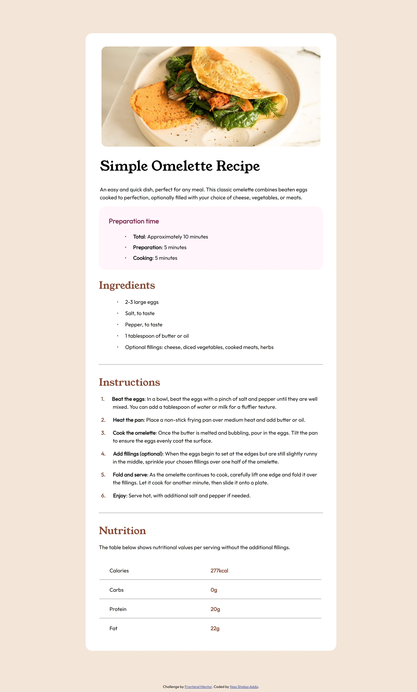

## Simple Omelette Recipe Page

https://rainaans.github.io/Recipe-Page - Link to hosted site

### Description

This project is a simple and visually appealing web page showcasing an easy and quick omelette recipe. It is perfect for any meal and demonstrates basic HTML and CSS skills.

### Features

- **Recipe Description:** Provides a brief introduction to the omelette recipe.
- **Preparation Time:** Lists the total, preparation, and cooking times.
- **Ingredients List:** Details the ingredients needed for the recipe.
- **Step-by-Step Instructions:** Guides users through the process of making the omelette.
- **Nutrition Information:** Displays nutritional values per serving without additional fillings.
- **Attribution:** Credits to the Frontend Mentor challenge and the developer.

### Project Structure

- **index.html:** The main HTML file containing the structure of the recipe page.
- **style.css:** The CSS file containing the styles for the recipe page.
- **images:** Directory containing images used in the project.

### Technologies Used

- **HTML5**
- **CSS3**

##### Challenge by Frontend Mentor.
##### Coded by Naa Shidaa Addo.
